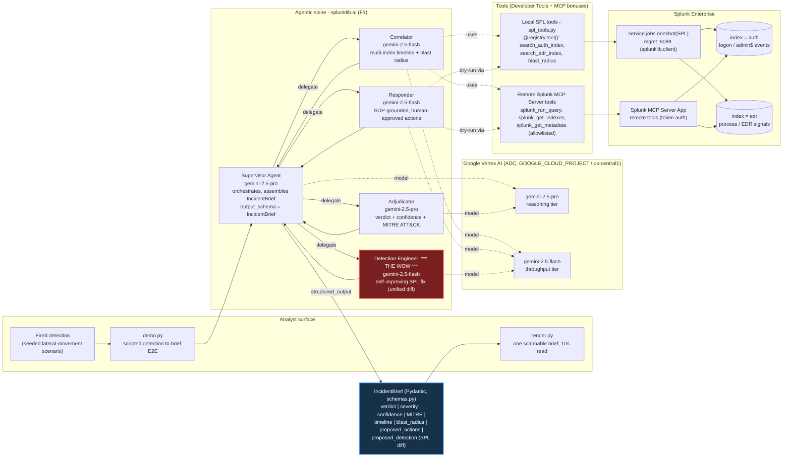

# Architecture — Sentinel Brief

A multi-agent **Detection-to-Decision war room** built on Splunk's `splunklib.ai`
agentic framework. When a detection fires, a supervisor agent fans out to four
specialist subagents, each on its own model tier, and assembles **one typed,
auditable `IncidentBrief`** — verdict, MITRE mapping, multi-index timeline,
ranked blast radius, human-approved containment actions, and the self-improving
SPL detection fix — in under three minutes.

The diagram reads in ~10 seconds: **left** is the analyst surface, **center** is
the agentic spine and its model tiers, **right** is Splunk (indexes + tools over
the management port and the MCP Server), and the **bottom** is the typed output
that renders the brief.

---

## System diagram

---

## Data flow (the <3-minute path)

1. **Detection fires.** `demo.py` composes the seeded scenario (a compromised
   `svc_backup` account pivoting from `WKS-014` across admin$ shares, preceded by
   a suspicious PowerShell download and a PsExec remote-exec signal) and hands it
   to the supervisor.
2. **Correlator** (flash) reconstructs the **multi-index timeline** and ranks the
   **blast-radius entities** by exposure, querying the `auth` and `edr` indexes
   through the local SPL tools (`ctx.service.jobs.oneshot`) and/or remote MCP
   tools.
3. **Adjudicator** (pro) returns the **verdict + confidence + severity** and maps
   the activity to **MITRE ATT&CK** technique IDs (e.g. `T1021.002` SMB/Admin
   Shares, `T1078` Valid Accounts, `T1059.001` PowerShell).
4. **Responder** (flash) proposes **SOP-grounded containment actions** — every
   action is `dry_run=true` and `requires_approval=true`; nothing auto-executes.
5. **Detection Engineer** (flash, **the wow**) closes the self-improving loop: it
   rewrites the over-firing correlation search, **adding an EDR-signal
   correlation** so the rule fires only when the admin-share fan-out is
   accompanied by an attack-tool EDR signal — removing the entire service-account
   false-positive class while preserving the true positive. The change is emitted
   as a **unified SPL diff**.
6. **Supervisor** (pro) assembles everything into one **typed `IncidentBrief`**
   via `output_schema=IncidentBrief`. `render.py` prints it as a single scannable
   view, with the SPL diff as the visual climax.

## Model tiers

| Tier | Model | Agents | Why |
|---|---|---|---|
| Reasoning | `gemini-2.5-pro` | Supervisor, Adjudicator | Orchestration + verdict/MITRE judgement need the stronger model |
| Throughput | `gemini-2.5-flash` | Correlator, Responder, Detection Engineer | High-volume correlation, action drafting, and SPL authoring run cheaper/faster |

Tiering is the `splunklib.ai` "context-bloat mitigation" pattern used at full
depth — a different model per specialist, not one model wearing four hats.

## Splunk integration (mock-backed today, real-SPL swap-in documented)

The spine is **decoupled from the live Splunk instance** so it builds and demos
without waiting on the environment ramp:

- **Today (mock path):** `mock_service.MockService` is a drop-in stand-in for a
  `splunklib.client.Service`. It satisfies `Agent.__aenter__` (the
  `authentication/current-context` username lookup) and serves the seeded
  `auth`/`edr` rows through the same `jobs.oneshot(...)` API the real service
  exposes. `demo.py` runs the full supervisor + 4-subagent spine on real Vertex
  models against this mock data.
- **Real-Splunk swap (Lane A merge):** replace `MockService()` with
  `splunklib.client.connect(host=..., port=8089, token=...)`. **Nothing in
  `agents.py`, `spl_tools.py`, or `schemas.py` changes** — the local SPL tools
  already call `ctx.service.jobs.oneshot(...)`, and the seed CSVs in `seed_data/`
  are generated from the *same* scenario constants as the mock, so the live brief
  matches the mock brief with zero drift. With the `Splunk_MCP_Server` app
  installed, the Correlator additionally discovers and invokes the remote MCP
  tools (token auto-minted by `splunklib.ai`); MCP is gated on the live backend
  and degrades cleanly to the local-SPL path if unavailable.

## Tool bonuses exercised

- **Splunk Developer Tools** — local SPL tools via `@registry.tool()` +
  `ToolContext.service` (`spl_tools.py`).
- **Splunk MCP Server** — the **Correlator** auto-discovers the remote MCP tools
  exposed by the installed `Splunk_MCP_Server` app, filters them by allowlist
  (`splunk_run_query`, `splunk_get_indexes`, `splunk_get_metadata`), and actually
  **invokes `splunk_run_query`** to verify the admin-share fan-out and EDR
  attack-tool signals against the live indexes — i.e. the agent queries Splunk
  *through* the MCP Server. The MCP token is minted automatically by `splunklib.ai`
  (no manual token). Live-gated and fail-safe: mock mode never touches MCP, and a
  failed MCP probe degrades to the local-SPL path with the brief unchanged. See
  `MCP-EVIDENCE.md` for the captured load + tool-call trace.
- **Splunk Hosted Models** — documented bonus lane (`| ai` path); the spine runs
  on Vertex so Hosted-Models availability on the trial is never load-bearing.
